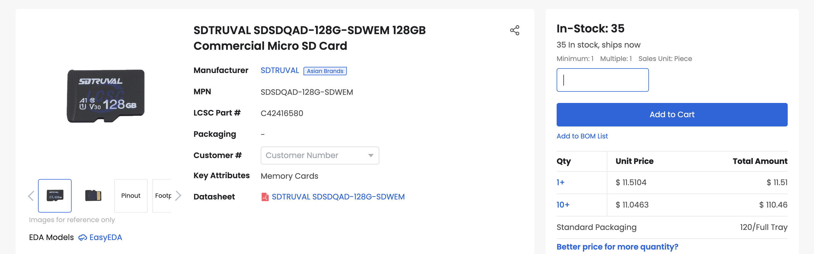
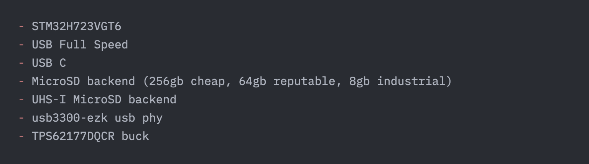
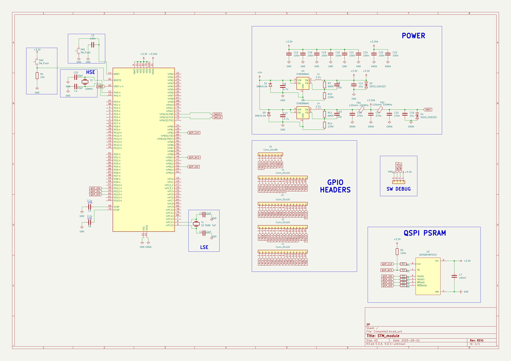
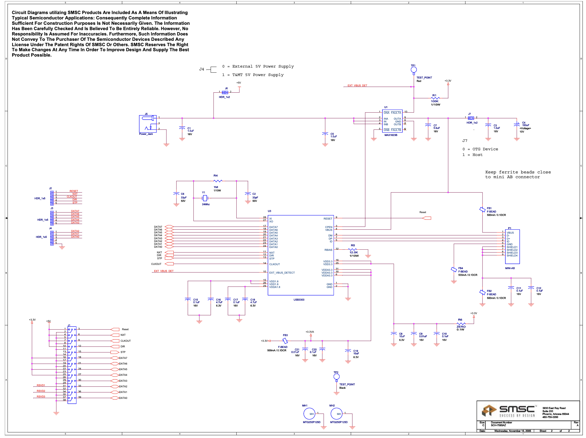
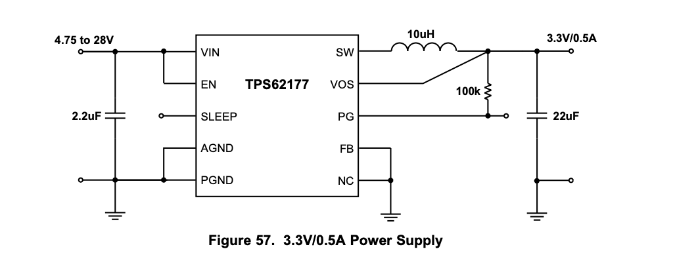
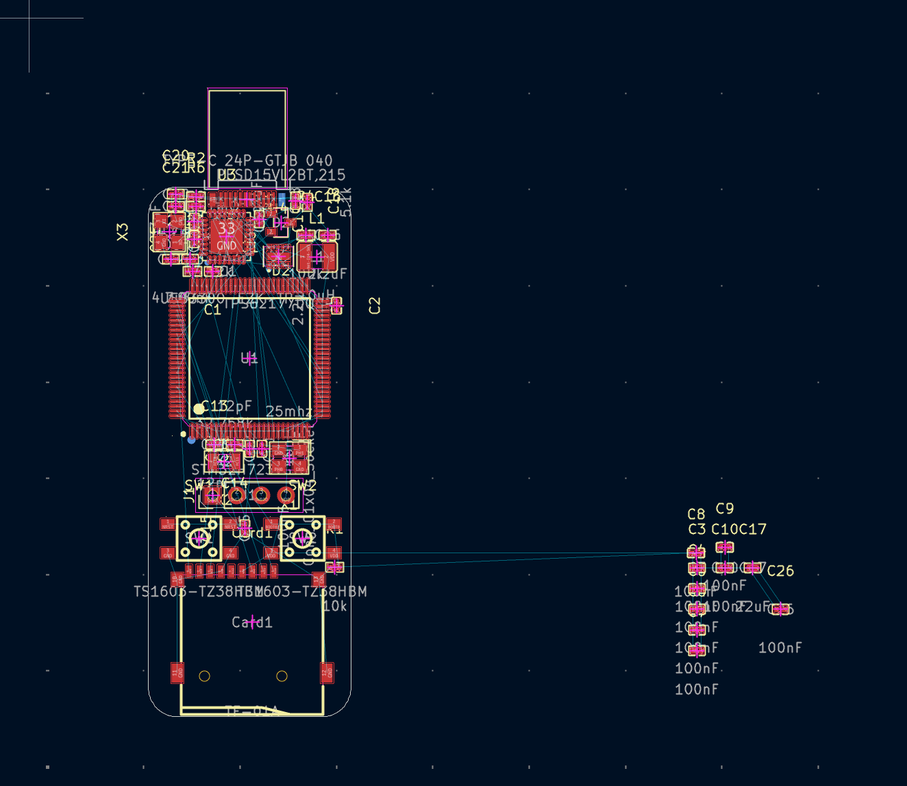
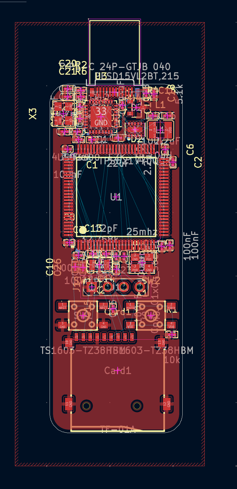
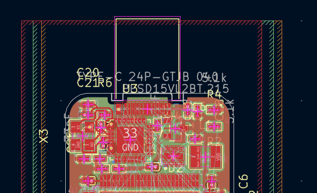
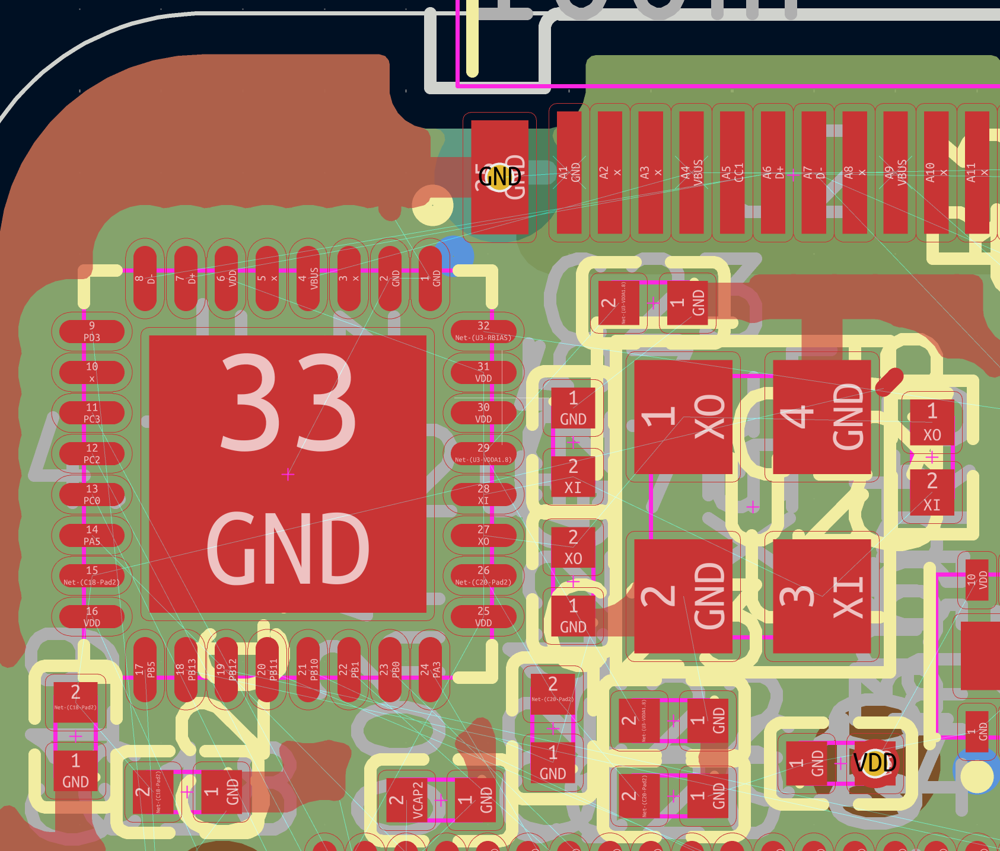

Jul 28, 0.5 hours

Basically came up with the idea and assessed feasability. After thinking about my previous hardware projects, I thought a flash drive would be super cool. Why?

 - I love USB. Doing HS would still be USB but would be slightly levelled-up. usb3.0 in general like requires like NDA or FPGA or custom ASIC, so I thought I would go one step up instead of two for now.
 - I realized that eMMC is super expensive these days! shoutout to the [2025–present global memory supply shortage](https://en.wikipedia.org/wiki/2025%E2%80%93present_global_memory_supply_shortage)
, I guess. Sort of affects all memory-related ICs. It's not as bad as $80 for 2GB of LPDDR4 chip ram though. Still, decently expensive. I decided for this project I wanted to actually store files of a meaningful size.
 - The solution? [MicroSD cards](https://xkcd.com/691/)!! They have great data density (the highest-end ones can store up to 2TB these days), and are pretty cheap, especially if you source them off of the OEM supply chain like LCSC rather than consumer marketplaces like Amazon. I found a deal for 128GB for just $10 (??! probably trash data durability or a scam or both, but anyways I found plenty of other cheap listings that aren't too-good-to-be-true cheap). Plus, hotswappable storage is very hacker aesthetic. 
 - The good news is that USB3.0 isn't even worth chasing anymore, since we'll be able to saturate the SD card link speed itself. The link speeds actually don't bottleneck each other too much either way. With UHS-I enabled microSDs we're looking at 50 megabytes per second, and maybe 30-40 without. Pretty good.

 

 yeah uh otherwise not much more to show, just research and concept

Jul 29, 0.5 hours

Did some research, locked in some more precise specs. 

STM chip is the chip for the job. So unfortuantely I will have to depart from my goat espressif for this project. There do exist STM chips that have built in USB2.0 HS PHY, but they are more expensive (the lcsc listing I found was low stock AND $28 per, which is crazy considering the rk3566 costs just $14).

In the end, STM32H723VGT6 plus usb3300 usb phy is the way to go. The STM *does* have built-in sd card phy which is nice, and the clock speed is more than enough to saturate USB2.0 link speed. Later, I could do something cool, like on-the-fly encryption or something

Jul 29, 4 hours

Time elapsed taken from gh commit timestamps, I was working pretty much continuously.

Had to find actual resources. The STM datasheet wasn't too helpful, and the [DISCO schematic](st.com/resource/en/schematic_pack/mb1248-h747i-d03-schematic.pdf
) was... pretty intimidating, because it has examples for *every* peripheral. I went off of a [reddit post](https://www.reddit.com/r/PCB/comments/1n8w67u/stm32h723vet6_breakout_board_feedback_advice_for/
) for hardware/strapping, and hopefully I can just expose some GPIOs, flash over SWD, and pray.

Then I just researched which pins to connect up for the sd card and found a proper example schematic for the USB PHY (although they put ferrite beads everywhere which I omitted).

TPS62177DQCR had a perfectly acceptable example schematic

Then I put it all together! Had to use an A3 sheet because so big lol 

The STM pins were unfortunately not... charitably labelled. I used a lot of cmd+f.

Also some confusion between VDD/VDDA and GND/GNDA. Since I'm not doing any analogue stuff, I merged them. Basically, the reddit PSU situation was way overengineered. That's why I went with the TPS.

So I guess research and schematic both took a surprising amount of time here.

Jul 29, 2.5 hours

Placement and routing !!

You know what they say, good placement is 90% of good routing. What's cool is that I was pretty much able to fit everything in a standard thumb-drive footprint. Well, a slightly chunky thumb drive. Thumb drives are usually 18x60mm ish with casing, mine stands at 20mm wide without casing. Still acceptable. 

this is my first four-layer PCB, although honestly it feels like a two-layer pcb because I'm trying to keep the gnd and power planes solid, so there are really only two signal planes, just like normal. For the two most common traces though, gnd and vcc, all you have to do is via down and you tap the plane. GND plane important for usb2.0 diff pair, and four-layer esp important because it means the layers are thinner so impedance matching works out.

I'm not here to talk about impedance matching though, I just did placement. Here are some progress pics:

Then I realized I had been putting off the differential pair when I really should have done it first. And really, my whole placement in that upper section was no good because of the rotation. I ended up completely refactoring the routing by changing the placement of the USB PHY ic. Which mean that the XO/XI caps plus the crystal had to all be re-placed.

