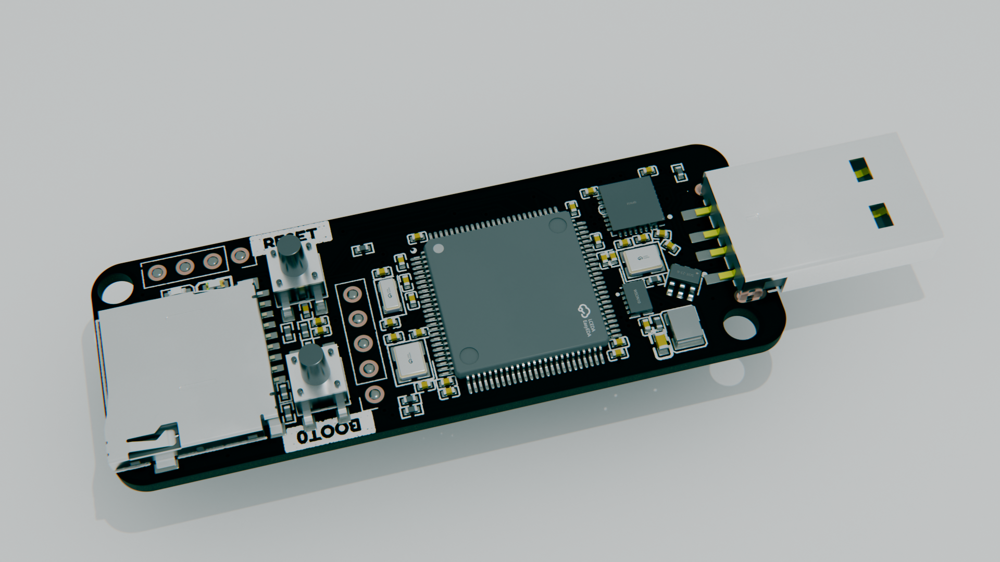
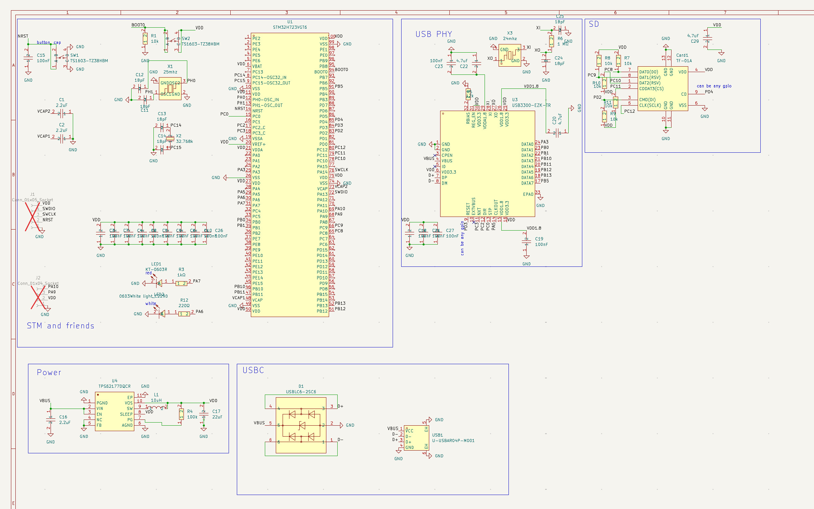
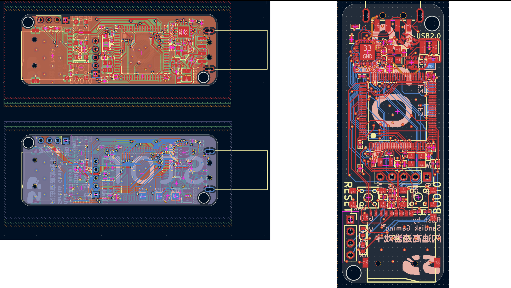
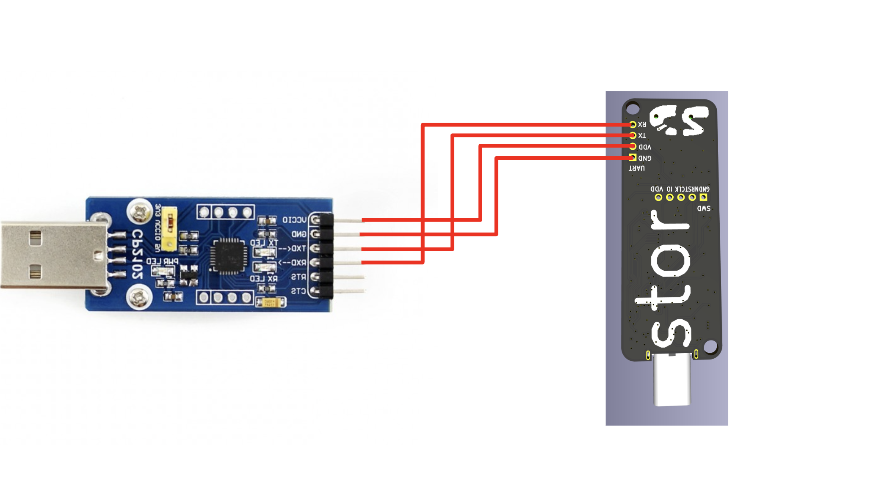
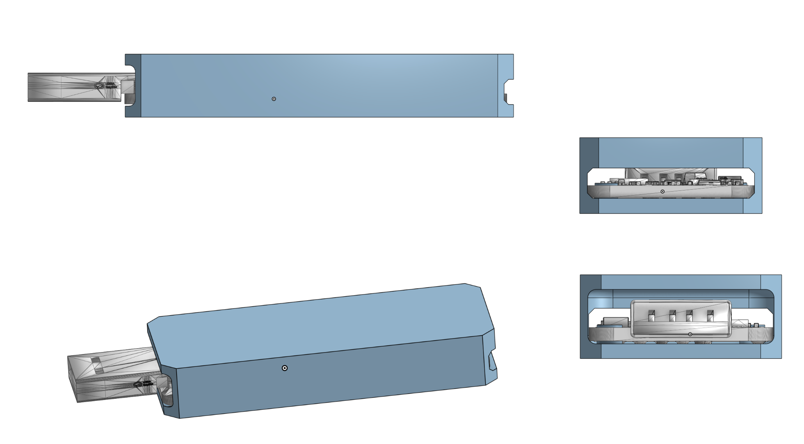

# stor



A USB2.0 High Speed flash drive with a hotswappable MicroSD backend. 

The specs:

- STM32H723VGT6
- USB3300-ezk usb PHY
- up to ~30-40 megabytes per second (untested), approximately saturating the USB2 link speed
- $0.059 per GB of genuine Sandisk because I got an amazing deal from an LCSC RFQ
  - That's a $15 256GB card!

I made this because I always thought USB flash drives were pretty neat. So much storage! Easy file transfer! Ability to USB-boot! Making my own seemed like the perfect justification. Then, I saw that eMMC prices have in fact been inflated in accordance with the whole 2026 AI RAM shortage thing. You know what is still cheap per GB? microSD. You can absolutely get a respectable amount of storage (64gb, 128gb, 256gb) for just $10-20 if you source smartly. And microSDs have endless customization. They go up to 2TB. There exist industrially-rated ones with super high endurance. And, unlike BGA eMMC, they are hot-swappable.

The STM middleman is also fun because it means I can do all sorts of things, from custom USB descriptors to on-the-fly encryption.

## Schematic



## PCB

[Kicanvas](https://kicanvas.org/?repo=https%3A%2F%2Fgithub.com%2FJBlitzar%2Fstor%2Ftree%2Fmain%2FPCB%2Fstor)

F.cu and B.cu:



## Usage

Standard USB to UART flashing configuration. Wiring diagram:



To flash the firmware:

Hold BOOT0, tap reset, release
BOOT0, then:

```bash
cd firmware
pio run -t upload
pio device monitor # to monitor logs
```

It also might be possible to flash over USB. I haven't tested it though. Instructions are in [firmware/README.md](firmware/README.md), but in short:
```bash
cd firmware
pio run
```
Then plug in the board, hold BOOT0, tap reset, release
BOOT0, then:
```bash
dfu-util -a 0 -s 0x08000000:leave -D .pio/build/stor/firmware.bin
```

I'll make this the default `pio run -t upload` behavior after it's been tested and verified.

Only plug in a microsd card after successfully initially flashing!

## CAD

Assembly STEP is at [cad/stor_assembly.step](cad/stor_assembly.step)

Case STEP is at [cad/stor_case.step](cad/stor_case.step)

Onshape link: https://cad.onshape.com/documents/a7e5e47cc0cfc056916b5738/w/17c4e94553a6fc2d4495a917/e/2d8b03d1ea07a2cbf9c4bec4?renderMode=0&uiState=6a7fdac0fa02538896f51f27




## Credits

[TinyUSB](https://github.com/hathach/tinyusb) for the USB stack! LICENSE file is included in [firmware/lib/tinyusb](firmware/lib/tinyusb)

## BOM


|Item                |Link                                                 |Cost |Notes                                                                                                                                                                                                                    |
|--------------------|-----------------------------------------------------|-----|-------------------------------------------------------------------------------------------------------------------------------------------------------------------------------------------------------------------------|
|CP2102 for flashing |http://waveshare.com/cp2102-usb-uart-board-type-a.htm|0    |Cost is zero because I'm flashing via FPGA. For others looking to reproduce, this is the simplest thing you can buy                                                                                                      |
|SD card             |https://www.lcsc.com/product-detail/C42416580.html   |0    |I'll be paying out of pocket or self-sourcing. Feel free to gnab whatever listing you want, this is a 128gb listing for which I have no idea if it'll be reputable. Your safest bet is a sandisk off of amazon or digikey|
|PCB                 |N/A                                                  |7.1  |green pcb; other colors cost $5 more                                                                                                                                                                                     |
|PCBA                |N/A                                                  |67.97|2x PCBA is the MOQ                                                                                                                                                                                                       |
|JLC shipping + taxes|N/A                                                  |3.3  |Shipping special offer; may cost up to $8, but at the same time I have some coupons. So the total will work out about the same                                                                                           |
|Total               |N/A                                                  |78.37|                                                                                                                                                                                                                         |
### Fabrication BOM

You'll find the rest of the fabrication outputs at [PCB/stor/production_real](PCB/stor/production_real)

|Designator          |Footprint                                            |Quantity|Value                                                                                                                                                                                                                    |LCSC Part #|
|--------------------|-----------------------------------------------------|--------|-------------------------------------------------------------------------------------------------------------------------------------------------------------------------------------------------------------------------|-----------|
|C1, C16, C2         |C0402                                                |3       |2.2uF                                                                                                                                                                                                                    |C12530     |
|C10, C15, C18, C19, C21, C23, C26, C27, C3, C4, C5, C6, C7, C8, C9|C0402                                                |15      |100nF                                                                                                                                                                                                                    |C1525      |
|C11, C12, C13, C14, C24, C25|C0402                                                |6       |18pF                                                                                                                                                                                                                     |C1549      |
|C17                 |C0603                                                |1       |22uF                                                                                                                                                                                                                     |C59461     |
|C20, C22, C29       |C0402                                                |3       |4.7uF                                                                                                                                                                                                                    |C23733     |
|CARD1               |TF-SMD_TF-01A                                        |1       |TF-01A                                                                                                                                                                                                                   |C91145     |
|D1                  |SOT-23-6_L2.9-W1.6-P0.95-LS2.8-BL                    |1       |USBLC6-2SC6                                                                                                                                                                                                              |C7519      |
|J1                  |PinSocket_1x05_P2.54mm_Vertical                      |1       |Conn_01x05_Socket                                                                                                                                                                                                        |           |
|J2                  |PinSocket_1x04_P2.54mm_Vertical                      |1       |Conn_01x04_Socket                                                                                                                                                                                                        |           |
|L1                  |IND-SMD_L3.2-W2.5_CKST322512-2.2UH                   |1       |10uH                                                                                                                                                                                                                     |C39846661  |
|LED1                |LED-SMD_L1.6-W0.8-R-RD                               |1       |KT-0603R                                                                                                                                                                                                                 |C2286      |
|LED2                |LED0603-R-RD_WHITE                                   |1       |0603White light_C2290                                                                                                                                                                                                    |C2290      |
|R1, R10, R11, R7, R8, R9|R0402                                                |6       |10k                                                                                                                                                                                                                      |C25744     |
|R12                 |R0402                                                |1       |220Ω                                                                                                                                                                                                                     |C25091     |
|R3                  |R0402                                                |1       |1kΩ                                                                                                                                                                                                                      |C11702     |
|R4                  |R0402                                                |1       |100k                                                                                                                                                                                                                     |C25741     |
|R5                  |R0402                                                |1       |12k                                                                                                                                                                                                                      |C25752     |
|R6                  |R0402                                                |1       |1 MΩ                                                                                                                                                                                                                     |C26083     |
|SW1, SW2            |SW-SMD_4P-L4.5-W4.5-P3.00-LS6.8                      |2       |TS1603-TZ38HBM                                                                                                                                                                                                           |C36938886  |
|U1                  |LQFP-100_L14.0-W14.0-P0.50-LS16.0-BL                 |1       |STM32H723VGT6                                                                                                                                                                                                            |C730142    |
|U3                  |QFN-32_L5.0-W5.0-P0.50-BL-EP3.4                      |1       |USB3300-EZK-TR                                                                                                                                                                                                           |C108383    |
|U4                  |WSON-10_L3.0-W2.0-P0.50-BL-EP                        |1       |TPS62177DQCR                                                                                                                                                                                                             |C91241     |
|USB1                |USB-SMD_KH-USB-AM-4P-CB                              |1       |U-USBAR04P-M001                                                                                                                                                                                                          |C386752    |
|X1                  |CRYSTAL-SMD_4P-L3.2-W2.5-BL                          |1       |25mhz                                                                                                                                                                                                                    |C9006      |
|X2                  |OSC-SMD_L3.2-W1.5                                    |1       |32.768k                                                                                                                                                                                                                  |C97606     |
|X3                  |CRYSTAL-SMD_4P-L3.2-W2.5-BL                          |1       |24mhz                                                                                                                                                                                                                    |C7420736   |
